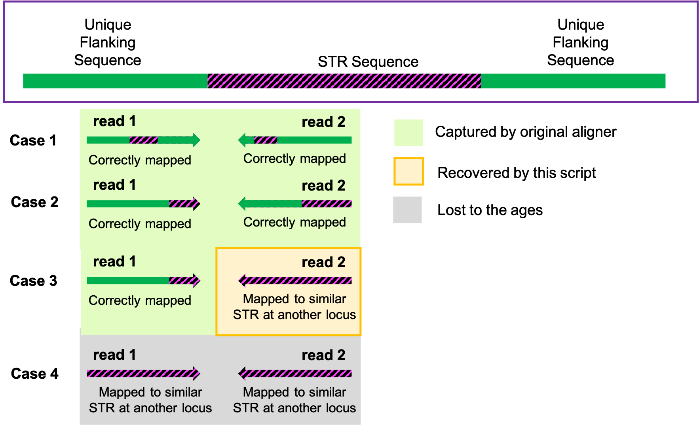

Find STR Extensions
===================

Sequencing aligners frequently misalign reads containing simple tandem repeats (STRs) that extend significantly beyond the reference genome. This can make it difficult to identify the presence of long STR extensions.

This script takes advantage of read pairing in bam/cram files to identify the presence of STR extensions.

A few important notes:

 1. **Paired-End Data** This script is intended for paired-end data.
 2. **Read Length Limitation** This script can identify the presence of STRs that extend beyond the length of a single read, but cannot identify the exact STR length if it is greater than the read length.
 3. **Defects and Changes in STR Sequence** The *repeats.txt* output only identifies the lengths for sequences of *pure* STR repeat. If there are defects in the STR (e.g. "CTTCTTCTT**T**CTT") or if the repeat changes (e.g. "CTTCTT**CCTCCT**"), the STR is interrupted and the lengths may not be useful. However, the *terminalSeq.txt* file gives displays the 3' and 5' termination of the STR for individual reads, which should give some insight into the presence/nature of any deviations from pure repetition.
 4. **Unique Flanking Sequence** This script relies on the accuracy of reads mapped to the sequence adjacent to the STR. Misaligned reads adjacent to the STR can lead to inaccuracy.

Background
----------

This script was developed to identify extensions in an STR near the Frataxin (FXN) gene at chr9:69037185-69037404 in the human genome (hg38). It should, however, be useable for other STRs as well.

Overview
--------

Broadly, this script works in two steps:

  1. **Identify STR Reads** *Samtools and Bedtools are used to extract all reads that map to the STR region along with their mates from bam/cram input*
  2. **Identify STR Lengths** *The distribution of STR lengths is determined*

Required Programs
-----------------

This script uses the following programs; alternate versions may also work:

  * [bedtools/2.27.1](https://github.com/arq5x/bedtools2)
  * [samtools/1.3.1](http://www.htslib.org/doc/1.3.1/samtools.html)

Flags
-----

| Flag | Argument                            | Default                     | Description                                                    |
|------|-------------------------------------|-----------------------------|----------------------------------------------------------------|
| -b   | BAM/CRAM file (required) | -                           | BAM/CRAM input file                                            |
| -g   | Fasta File (required)                   | -                           | The genome file that matches the alignment                               |
| -o   | string (required)                  | -                           | the basename for the output file                                 |
| -r   | STR region (required)                  | -                           | The region containing the STR, including unique flanking sequence, e.g. chr9:69037185-69037404 for the Frataxin STR         |
| -s   | string (required)                  | -                          | The repeat sequence in the STR, e.g. "CTT" for the Frataxin STR                                               |
| -l   | read length (optional)              | 150                           | the number of bases in a single read   |
| -t   | integer (optional)              | 1                           | the number of threads to use                                      |
| -h   | no argument (optional)              | -                           | print usage                                                    |

Example Usage
-------------

Running get-STR-extensions.sh on the Frataxin STR:

      ./get-STR-extensions.sh -b sample1.bam -g ./Homo_sapiens_assembly38.fasta -s CTT -r chr9:69037185-69037404 -o sample1-CTT

Output
------

| File              | Description                                               |
|-------------------|-----------------------------------------------------------|
| *fq               | A fastq file with all identified reads for the STR region |
| *_repeats.txt     | A table of repeat lengths and read counts by length       |
| *_terminalSeq.txt | a list of STRs by read with the flanking sequences        |
